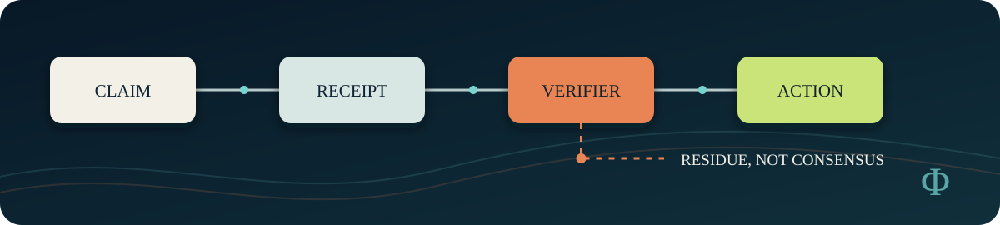

  

# Reg Saddler

**Independent AI safety researcher and systems architect building evidence-gated methods for multi-agent systems.**

> I build AI systems that have to show their work before their outputs can authorize action.

My current work asks a practical question: when several AI agents agree, what would justify treating that agreement as evidence rather than repetition? I build small, inspectable tools for provenance, verifier independence, adversarial testing, and fail-closed decisions.

## Public work

### [semantic-entropy](https://github.com/regsaddler/semantic-entropy)

A standard-library-only Python implementation of semantic-entropy screening for answer stability.

- Runs locally against OpenAI-compatible endpoints.
- Includes 45 deterministic self-checks.
- Treats stability as a screening signal, never as truth.
- Publishes the preregistration and negative result from an extension that failed its own criterion.

That last point matters. I kept the simpler version instead of tuning the experiment until it passed.

### [receipt-run-lite](https://github.com/regsaddler/receipt-run-lite)

A small standard-library wrapper that preserves what a local command actually returned.

- Captures exit status, elapsed time, byte counts, and SHA-256 hashes.
- Keeps raw command arguments out of the receipt unless explicitly requested.
- Refuses to overwrite existing output paths.
- States its limits mechanically: unsigned, not independently validated, and not proof of correctness.

## Research direction

- Multi-agent influence, shared context, and shared-evidence dependence
- Verifier independence and authority boundaries
- Claim provenance, reproducible receipts, and negative controls
- Context continuity without silently promoting stale state
- Harness changes that must outperform boring baselines and survive removal tests

  

## Working rule

A fluent answer is not a verified answer. A clean test is not scientific validation. A failed experiment is useful when its falsifier, inputs, and limits remain visible.

My work therefore follows a short loop:

1. State what would change the decision.
2. Pre-register the expected effect and failure condition.
3. Compare against a simple baseline.
4. Preserve the raw result and the negative case.
5. Promote nothing from self-certification alone.

## Background

I founded [Difference Theory](https://differencetheory.com) after a career in enterprise systems, networks, security, migrations, and recovery. Earlier public work included digital publishing and information propagation at scale. I was a founding co-host of [*The Drill Down*](https://geeksofdoom.com/2012/09/21/the-drill-down-249-flashback-to-number-one) and returned for its [500th episode](https://geeksofdoom.com/2017/11/10/drill-down-500-ten-years-tech).

## Contact

[Difference Theory](https://differencetheory.com) · [LinkedIn](https://www.linkedin.com/in/zaibatsu/) · [semantic-entropy](https://github.com/regsaddler/semantic-entropy)

I am open to technical review, adversarial probes, and research conversations about dependable multi-agent systems.
